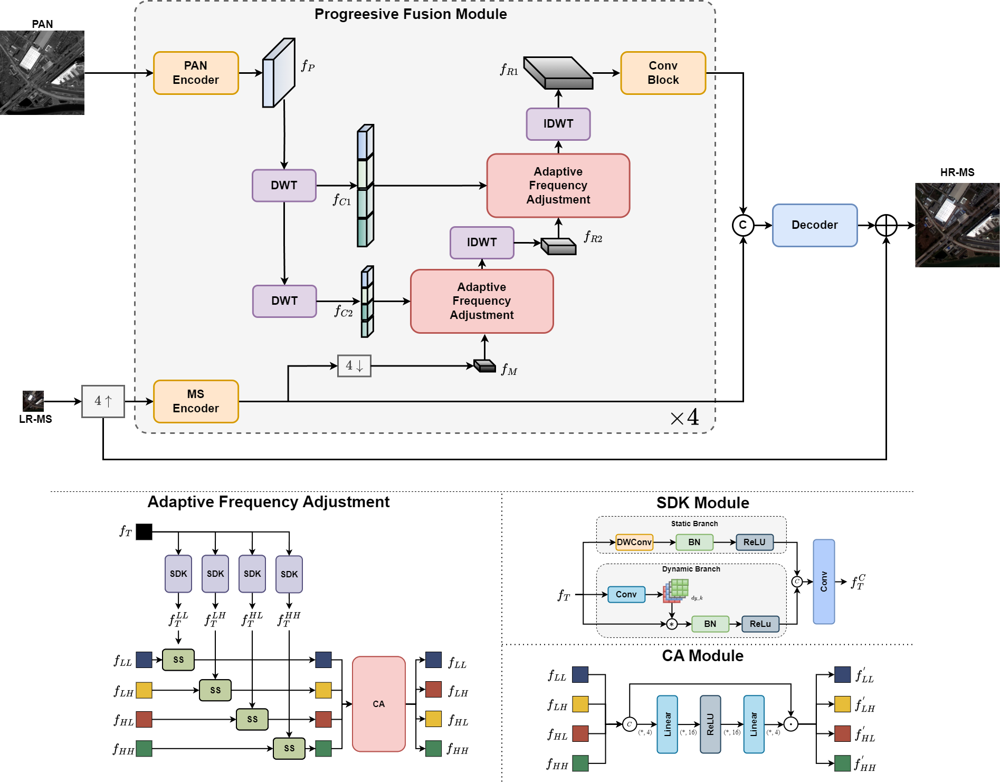

# [Progressive Reconstruction Network With Adaptive Frequency Adjustment for Pansharpening]
(https://ieeexplore.ieee.org/document/10660478) (JSTARS 2024)

This is the PyTorch implementation of our paper: 

**Progressive Reconstruction Network With Adaptive Frequency Adjustment for Pansharpening (PRNet)**

IEEE Journal of Selected Topics in Applied Earth Observations and Remote Sensing

Xin Zhao; Yueting Zhang; Jiayi Guo; Yangguang Zhu; Guangyao Zhou; Wenyi Zhang; Yirong Wu




*** 

## Datasets
We use public available datasets [PanCollection](https://github.com/liangjiandeng/PanCollection).  

## Train the Model 
1. You need to specific the data root of the [training data root](./train.py#L80) and [validation data root](./train.py#L91)
2. train the model

**demo**
```shell
python train.py --ds=${wv3} 
```

***

## Test the Model

### Test the model on Reduce Resolution

```shell
python eval_rr.py --ds=${wv3}
```

### Test the model on Full Resolution

For full resolution evaluation, please refer to [DLPAN-Toolbox](https://github.com/liangjiandeng/DLPan-Toolbox)

***

## Citation
If you find this repo is helpful to your research. Please consider cite our work.
```
@ARTICLE{10660478,
  author={Zhao, Xin and Zhang, Yueting and Guo, Jiayi and Zhu, Yangguang and Zhou, Guangyao and Zhang, Wenyi and Wu, Yirong},
  journal={IEEE Journal of Selected Topics in Applied Earth Observations and Remote Sensing}, 
  title={Progressive Reconstruction Network With Adaptive Frequency Adjustment for Pansharpening}, 
  year={2024},
  volume={17},
  number={},
  pages={17382-17397},
  doi={10.1109/JSTARS.2024.3452311}}
```
